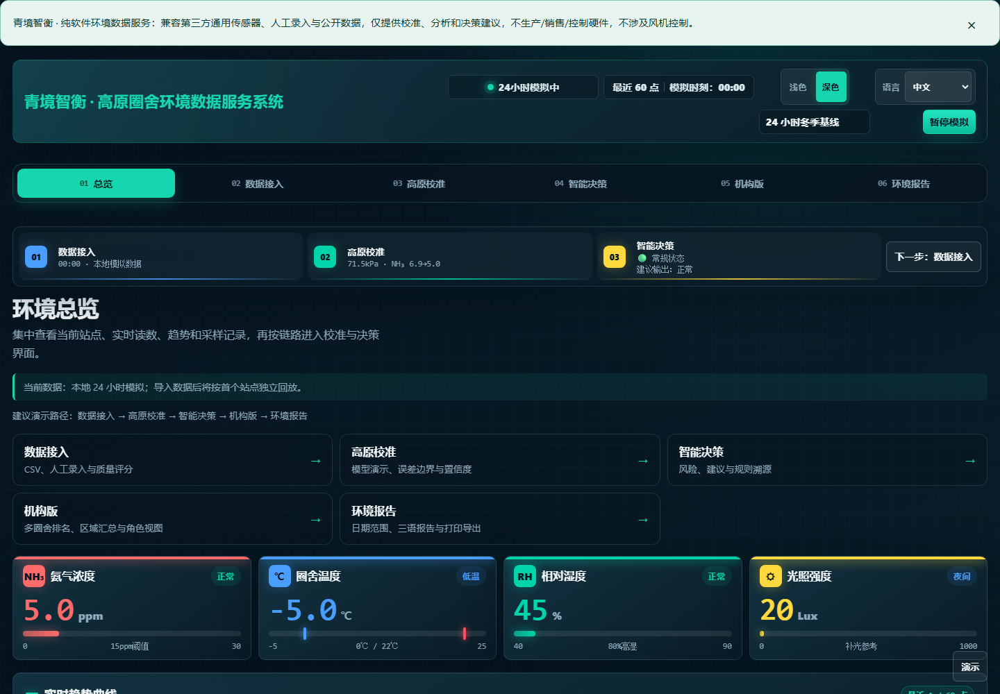
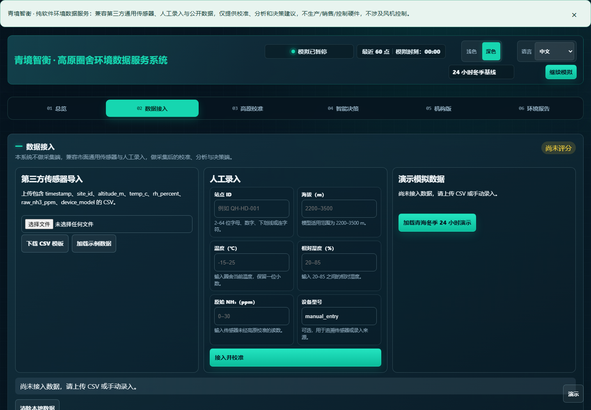
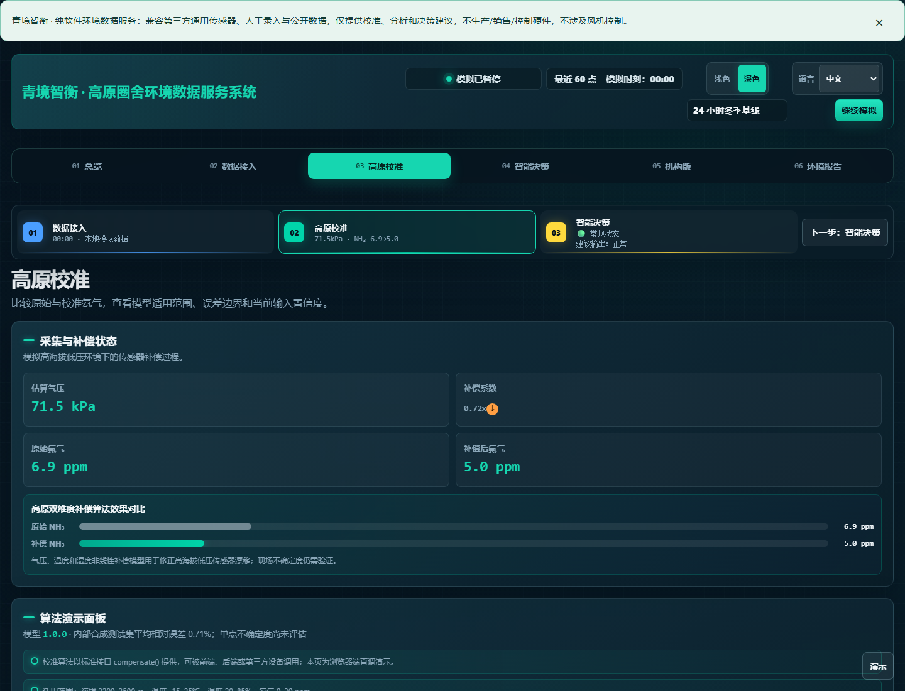
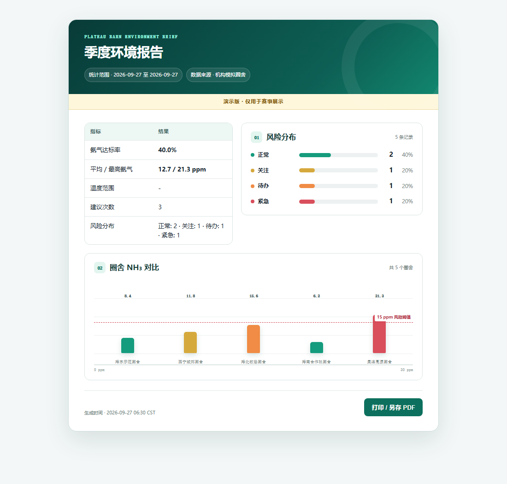

# 青境智衡（QJZH）

青境智衡是一个面向环境监测数据的本地优先分析工作台。它把数据导入、质量检查、风险判读、情景模拟和可审阅报告串成一条可追溯的浏览器工作流。项目可以直接在 GitHub Pages 上体验，也可以下载到本地运行；默认演示数据仅用于展示界面与计算流程。

## 在线体验

- 主页：<https://runner-cpu.github.io/QJZH/>
- 在线自检：<https://runner-cpu.github.io/QJZH/online_test.html>
- 发布构建信息：<https://runner-cpu.github.io/QJZH/build_info.js>

页面不需要账号，不会把导入的 CSV 上传到远程服务。浏览器刷新后，当前页面内存中的导入数据会被清空。

## 界面导览

以下截图来自公开演示界面，帮助快速定位主要操作区域：

## 项目边界

本项目用于数据整理、指标计算、规则解释和报告预览，不替代法定检测、专业审查或现场处置。输出结果是可解释的风险提示，不是诊断结论、合规结论或处置指令。使用者应核对原始记录、采样条件、单位和时间范围，并由具备相应权限的人员做最终判断。

## 六个工作视图

1. **总览**：查看数据规模、风险分布、质量概况和当前计算批次。
2. **数据接入**：导入 CSV、检查表头与字段约束、查看拒绝原因，并在提交前预览记录。
3. **算法解释**：逐项查看规则、权重、置信度和触发依据；每次导入都会重新计算派生值。
4. **机构/区域分析**：按区域或分析单元聚合指标，比较样本量、风险水平和数据完整度。
5. **情景模拟**：调整可解释的输入因子，观察风险等级与建议动作的变化。
6. **报告**：生成可打印、可保存的摘要报告，包含数据范围、限制说明、计算时间和免责声明。

## 快速开始

直接打开在线主页即可查看演示数据。若要使用自己的数据：

1. 进入“数据接入”。
2. 下载页面提供的 CSV 模板，或按下方字段创建 UTF-8 CSV 文件。
3. 选择文件并等待预检结果；所有错误都会在提交前显示。
4. 确认记录数、时间范围和单位无误后导入。
5. 在“算法解释”核对触发规则，在“报告”导出结果。

## 本地运行

项目是静态前端，不需要构建后端。建议使用任意静态文件服务器，避免浏览器对本地文件的模块和资源策略产生差异。

~~~text
git clone https://github.com/runner-cpu/QJZH.git
cd QJZH/deploy-gh-pages
python -m http.server 8080
~~~

然后访问 <http://localhost:8080/>。也可以使用 Node、Nginx 或其他静态服务器指向本目录。

## CSV 数据格式

最小字段集合如下，字段名必须完全匹配模板：

| 字段 | 类型 | 说明 |
| --- | --- | --- |
| site_id | 文本 | 站点或样本的稳定标识 |
| timestamp | ISO-8601 时间 | 采样或观测时间，建议包含时区 |
| temperature | 数值 | 温度指标 |
| ph | 数值 | pH 指标 |
| turbidity | 数值 | 浊度指标 |
| dissolved_oxygen | 数值 | 溶解氧指标 |
| ammonia_nitrogen | 数值 | 氨氮指标 |

导入器会拒绝空表头、重复表头、未知字段、缺失字段、非法时间、超出允许范围的数值、原型污染字段和无法安全解析的行。派生指标不会直接信任 CSV 中的同名列，而是由当前版本算法重新计算。

### 输入硬限制

- 文件大小不超过 1 MiB；
- 数据行不超过 5,000 行；
- 字段数量不超过模板定义；
- 单个字段长度不超过 256 个字符；
- 空文件和只有表头的文件不作为有效数据集。

这些限制用于保持浏览器响应速度、避免意外资源消耗，并减少不完整输入进入分析流程的机会。

## 数据生命周期与隐私

CSV 在浏览器内解析，经过校验后保存在当前页面的运行时状态中。项目没有默认的上传接口、账号系统、远程数据库或第三方分析脚本。报告导出由浏览器完成；如果使用者主动把文件、截图或报告发送给他人，后续传播由发送者负责。

使用敏感数据前，请先脱敏站点名称、坐标、人员信息和内部编号。关闭页面或刷新后，未导出的运行时数据不会被项目恢复。

## 算法与可信度边界

计算由规则库、决策引擎、补偿引擎、模型权重和模拟器共同完成。界面会展示输入摘要、触发规则、权重、置信度和限制说明，帮助审阅者复算关键结论。

置信度表示当前规则与输入质量下的相对可信程度，不等同于统计显著性、检测准确率或未来事件概率。缺失值、异常值、样本量不足、时间范围过窄和单位错误都会降低解释价值。任何结论都应结合原始记录与领域知识复核。

算法核心文件由原创清单保护。对核心实现的更改必须同步更新文档、测试和原创清单；发布前会验证文件哈希和许可证条款。

## 主要文件

| 路径 | 作用 |
| --- | --- |
| index.html | 主应用页面与布局 |
| dashboard.js | 总览与交互状态 |
| dataImport.js | CSV 解析、校验和派生值重算 |
| knowledgeBase.js | 规则与知识条目 |
| decisionEngine.js | 风险判读与解释链 |
| compensator_engine.js | 补偿计算 |
| model_weights.js | 模型权重与版本信息 |
| simulator.js | 情景模拟 |
| reportGenerator.js / reportRenderer.js | 报告生成与渲染 |
| scripts/build-pages.js | GitHub Pages 白名单构建 |
| scripts/verify-originality.js | 原创文件哈希与许可校验 |
| verify-deployment.js | 发布产物与运行时契约检查 |
| tests/ | 自动化质量、视觉和治理测试 |

## 质量检查与发布

本地发布前建议依次执行：

~~~text
node scripts/verify-originality.js
node verify_compensator.js
node --test tests/*.test.js
node scripts/build-pages.js --out dist
node verify-deployment.js dist
git diff --check
~~~

scripts/build-pages.js 只复制明确列出的运行时文件和公开文档，不会把测试、备份、临时输出或内部计划目录带到 Pages。构建会生成 build_info.js，其中包含提交 SHA、构建时间和环境标识，便于线上回溯。

## 版权、原创与安全

本仓库采用项目根目录 LICENSE 中的定制“保留所有权利”许可，不授予默认复制、改编、再发布、商用、去除署名、提取模型参数或建立衍生服务的权利。允许在不修改的本地副本上查看、运行和进行内部评估；超出范围请先取得书面许可。

- 版权边界：[COPYRIGHT.md](COPYRIGHT.md)
- 原创组成与证据：[ORIGINALITY.md](ORIGINALITY.md)
- 安全问题报告：[SECURITY.md](SECURITY.md)
- 数据字段说明：[docs/DATA_DICTIONARY.md](docs/DATA_DICTIONARY.md)
- 用户操作手册：[docs/USER_GUIDE.md](docs/USER_GUIDE.md)
- 发布清单：[docs/RELEASE_CHECKLIST.md](docs/RELEASE_CHECKLIST.md)

项目不使用阻断右键、禁用键盘、破坏屏幕阅读器或恶意反爬等手段。保护措施集中在许可证、署名、公开发布白名单、哈希清单、审计记录和安全响应流程上。

## 反馈与贡献边界

欢迎提交可复现的错误信息、浏览器版本、最小输入样例和期望行为。请不要在公开 issue 中上传真实敏感数据、访问凭据或未公开的内部记录。任何代码、文档、图像或规则贡献都必须明确来源并符合本项目许可证；未经维护者确认，不得将项目文件镜像到其他产品或服务中。

## 状态说明

这是一个持续维护的静态分析工具。规则、阈值、字段和界面可能随版本调整；请在引用结果时记录页面显示的构建 SHA、数据时间范围和导出报告版本。
